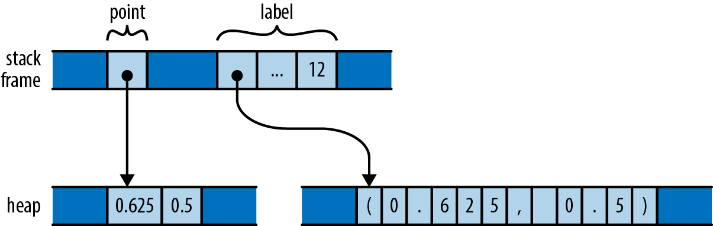

# Illustrations
The following illustrations are from [Programming Rust](https://www.oreilly.com/library/view/programming-rust-2nd/9781492052586/) and [The Rust Book](https://rust-book.cs.brown.edu).

#### A vector
```rust
let padovan = vec![1, 1, 1, 2, 2, 3, 4, 5, 7, 9];
```


#### A box and a string
```rust
let point = Box::new((0.625, 0.5));
let label = format!("{:?}", point);
```


#### A vector containing instances of a struct
```rust
struct Person { name : String, birth : i32 }
let mut composers = Vec::new();
composers.push(Person { name : "Palenstrina".to_string(), birth: 1525 });
composers.push(Person { name : "Dowland".to_string(), birth: 1563 });
composers.push(Person { name : "Lully".to_string(), birth: 1632 });
```


#### A string and a ref to it
```rust
let s1 = String::new("hello");
let s = &s1;
```
`s` stores the address of `s1`.


#### A vec containing strings
```rust
let s = vec!["udon".to_string(), "ramen".to_string(), "soba".to_string()];
let t = s;
```
__`s` in memory__


__The result of assigning `s` to `t`__


#### Assigning a String moves the value, whereas assigning an i32 copies it
```rust
let string1 = "somnambulance".to_string();
let string2 = string1;
let num1 : i32 = 36;
let num2 = num1;
```

