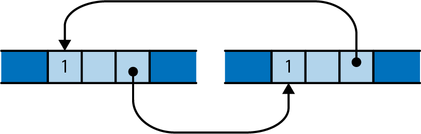

# Rc And Arc
In Rust, __Rc (short for "reference counted")__ and __Arc (short for "atomic reference counted")__ are types that allow you to share values between multiple owners. They are similar to Box, which represents ownership of a value on the heap, but they allow multiple owners.

Rc is a non-thread-safe reference counted type, which means that it is not safe to share an Rc value between threads. It is useful for sharing values within a single-threaded context, such as when building a tree data structure. A value owned by an Rc pointer is immutable.

Arc is a thread-safe reference counted type, which means that it is safe to share an Arc value between threads. It is useful for sharing values between threads, because it allows multiple threads to access the value concurrently.

### Rc in memory
```rust 
use std::rc:Rc;
let s : Rc<String> = Rc:new("shirataki".to_string());
let t : Rc<String> = s.clone();
let u : Rc<String> = s.clone();
```


### Well-known problem with using reference counts
One well-known problem iwht using reference counts to manage memory is that, if there are ever two reference-counted values that point to each other, each will hold the other's reference count above zero, so the values will never be freed.



