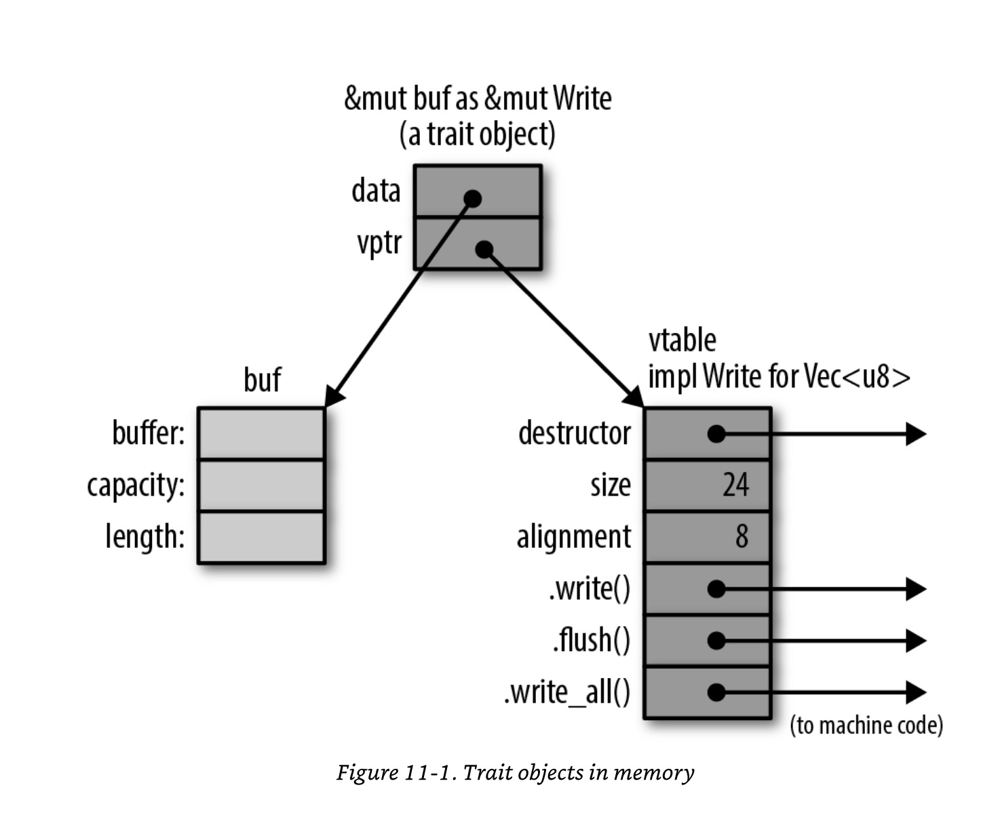

# Fat & Thin Pointer

#### Thin pointer
- A thin pointer only contains the memory address it points to.
```rust
let a = 10;
let ra = &a;
println!("{:p}", &a);
println!("{:p}", ra);

assert_eq!(format!("{:p}", &a), format!("{:p}", ra));

let rra = &ra;
println!("{:p}", &ra);
println!("{:p}", rra);
assert_eq!(format!("{:p}", &ra), format!("{:p}", rra));
```

#### Fat pointer
- [stackoverflow answer](https://stackoverflow.com/questions/57754901/what-is-a-fat-pointer)

A fat pointer contains both the address of a memory location it points to and additional metadata like the length of the allocation or  a pointer to vtable in `Trait Object`.

#### `&[T]`, `&mut [T]`, `&str` are fat pointers  
A reference to a slice `[T]` or `str` is a fat pointer, carrying the starting address of the slice and its length. `[T]` and `str` are dynamically sized types and that's the reason we see them as `&[T]`, `&mut [T]` and `&str`.

The representation of `&[T]`, `&mut [T]`, `&str` might look like below:
```rust 
struct SliceRef {
    ptr : *const i32
    len : usize
}
```

```rust 
let arr : [i32; 5] = [1, 2, 3, 4, 5]; 
let slice_arr : &[i32] = &arr[..3];
println!("{slice_arr:?}");
println!("{:p}", &arr);
println!("{:p}", slice_arr);
assert_eq!(format!("{:p}", &arr), format!("{:p}", slice_arr));

println!("{}", std::mem::size_of::<i32>()); // 4 bytes
println!("{}", std::mem::size_of::<[i32; 5]>()); // 4 * 5 = 20 bytes

// size of the pointer pointing to value of type [i32; 5] 
println!("{}", std::mem::size_of::<&[i32; 5]>()); // 8 bytes

// &[i32] is a fat pointer
println!("{}", std::mem::size_of::<&[i32]>()); // 16 bytes

// &str is a fat pointer
println!("{}", std::mem::size_of::<&str>()); // 16 bytes
```

#### Trait Object is a fat pointer
A reference to a trait type is called a trait object. A Trait Object consists of a pointer to the value, plus a pointer to a table representing that value's type.

```rust 
let mut buf = Vec::new();
let writer : &mut dyn std::io::Write = &mut buf;

println!("{}", std::mem::size_of::<Vec<i32>>()); // 24 bytes - buffer, capacity, length
println!("{}", std::mem::size_of::<Vec<String>>()); // 24 bytes bytes - buffer, capacity, length

println!("{}", std::mem::size_of::<&dyn std::io::Write>()); // 16 bytes
```


