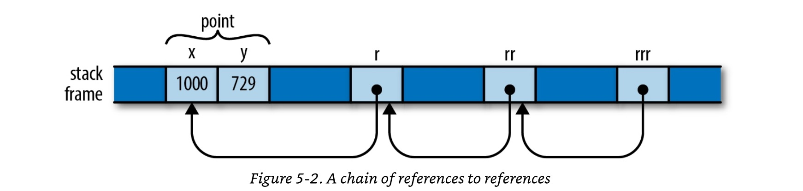

# Reference

References are created explicitly with the `&` operator, and dereferenced explicitly with the `*` operator.

```rust 
    let x = 10;
    let rx = &x;
    assert!(*rx == 10);

    let mut y = 11;
    let ry = &mut y;
    *ry += 1; 
    assert!(*ry == 12);
```

The `.` operator implicitly dereferences its left operand if needed.

```rust
pub struct Person {
    name : &'static str,
    age : f32
}

let john_ref = &john;

assert!(john_ref.name == "John"); // implicitly dereference
assert!((*john_ref).name == "John"); // same as above, but with explicit dereference
assert!(john_ref.age == 40.3);
assert!((*john_ref).age == 40.3);
```

> The `.` operator can also implicitly borrow a reference to its left operand, if needed for a method call.

```rust
let mut v = vec![10, 20, 3];
v.sort(); // implicitly borrow a mutable reference to v
(&mut v).sort(); // same as above
```

#### Assigning References
Assigning to a Rust reference makes it point at a new value:
```rust 
let x = 10;
let y = 20;
let mut r = &x;
println!("{r}");
r = &y;
println!("{r}");
```

#### References to References
Rust permits references to references.
```rust 
struct Point { x : f32, y : f32 }

let p1 = Point { x : 1000, y : 729 };
let r : &Point = &p1;
let rr : &&Point = &r;
let rrr : &&&Point = &rr;

assert_eq!(rrr.y, p1.y);
assert_eq!((*(*(*rrr))).y, p1.y);
```
> The . operator follows as many references as it takes to find its target as seen above `rrr.y`

#### Borrow an illustration from The Programming Rust Book


#### Comparing References
> Like the . operator, Rust's comparison operators "see through" any number of references, as long as both operands have the same type.
```rust 
let a = 10;
let b = 20;
let c = 10;

let ra = &a;
let rb = &b;
let rc = &c;

let rra = &ra;
let rrb = &rb;
let rrc = &rc;

assert!(rra < rrb);
assert!(rra <= rrb);
assert!(rra == rrc);
assert!(rrb > rrc);
assert!(rrb >= rrc);

// both operands should have same level of references
assert!(rrb >= &&10); 

// Arithmetic operators can see through only one level of references
assert!(rb == &(ra + &10));
```

> Arithmetic operators can see through only one level of references

#### Checking references pointing to same memory location
> `std::ptr::eq`
```rust 
let x = 1;

let rx1 = &x;
let rx2 = &x;

println!("{}", std::ptr::eq(rx1, rx2));
```

> References are never Null and there is no default initial value for a reference. If you need a value that is either a reference to something or not, use the type `Option<&T>`.

#### Borrowing references to arbitrary expressions
Rust allows you borrow a reference to the value of any sort of expression at all.
```rust
fn get_str() -> String {
    "hello".to_string()
}

fn main() {
    // Rust here create an anonymous variable 
    // and make sure it is variable as long as the variable s
    let s = &get_str(); 
    println!(s);
}
```
